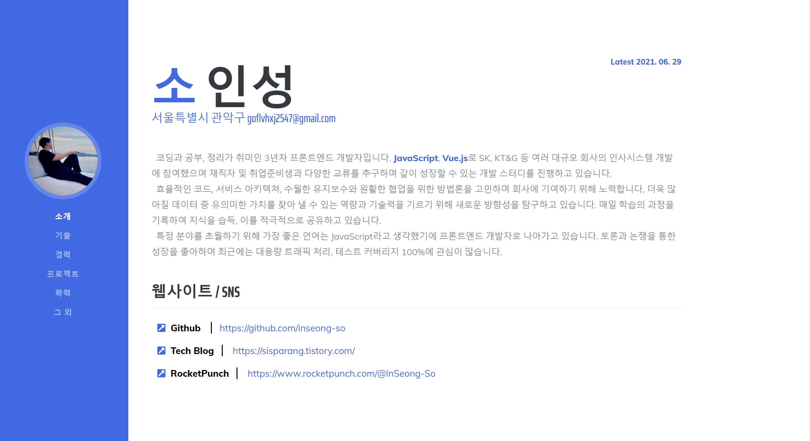

# 열정적인 인성's 이력서

## [★★★★★★★ 열정적인 인성's 이력서 이력서 보기 ★★★★★★★](https://inseong-so.github.io/new-resume/)

 

## Plan
### TODO
- [ ] 포트폴리오 완성 후 추가
- [ ] 프로젝트 종료시 이력 추가
- [ ] 리눅스 마스터 1급 취득
- [ ] 파이썬 마스터 취득

 

### DOING
- [x] 목차 정리

 

### DONE
- [x] 구조 설계, 디자인
- [x] Profile 작성
- [x] ETC 작성
- [x] Footer 작성 및 최종 수정
- [x] 자격증 항목 추가
- [x] Dev SKill 작성
- [x] Work History & Education 작성

 

## Record
- 2019-02-11 생성 및 작성 중
- 2019-08-21 재작성
- 2019-12-01 자격증 내역, 자기개발 활동 추가
- 2019-12-27 목차 정리, 세부 내용 추가, 기술 스택 변경
- 2019-12-31 자격증 추가(SQLD)
- 2020-03-20 토이 프로젝트 추가(AutoExpense)

 

## Reference
- [부트스트랩 자료](https://www.w3schools.com/)
- [부트스트랩 템플릿](https://startbootstrap.com/themes/resume/)
- [프론트엔드 기능](https://codepen.io/)
- [유료템플릿](https://themeforest.net/)
- [반응형 템플릿](https://aperitif.io/)

 